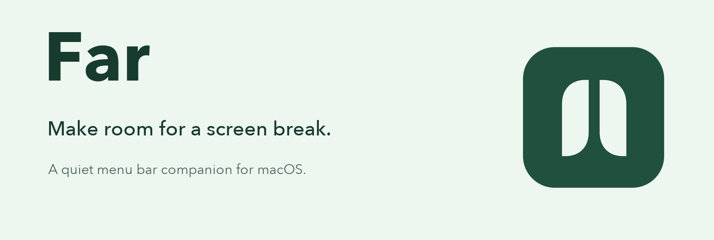
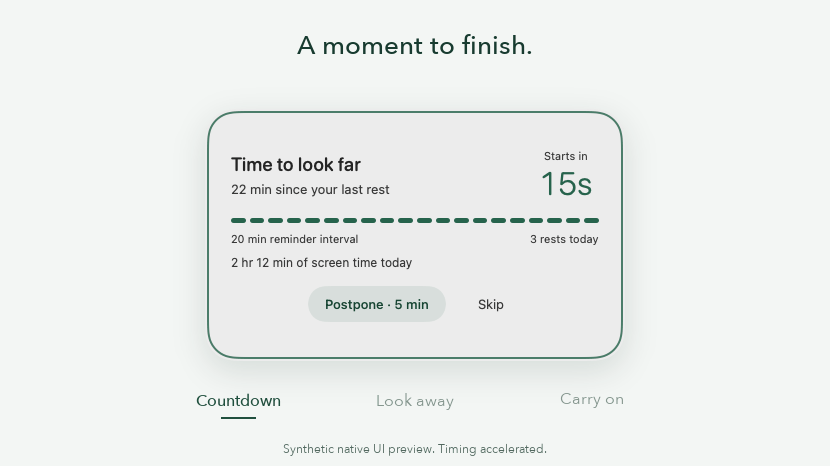

<p align="center">
  
</p>

<p align="center">
  A small, native macOS app for taking a moment away from your screen.<br>
  A little notice. Room to rest. Back to your day.
</p>

<p align="center">
  <a href="https://github.com/theablemo/Far/releases/latest"></a>
  
  
  <a href="LICENSE"></a>
</p>

<p align="center">
  <a href="https://github.com/theablemo/Far/releases/latest"><strong>Download for Mac</strong></a>
  &nbsp; · &nbsp; <a href="#how-it-works">How it works</a>
  &nbsp; · &nbsp; <a href="#build-and-run">Build from source</a>
  &nbsp; · &nbsp; <a href="https://github.com/theablemo/Far/issues">Report an issue</a>
</p>

## A break that fits your day

Far lives in your menu bar. When a break is due, a quiet countdown gives you time to finish a thought. A centered prompt then invites you to look away while your displays dim. Your desktop stays usable, and **Postpone** and **Skip** stay within reach.

<p align="center">
  
</p>

<p align="center"><sub>Accelerated sequence of native UI fixtures with sample data and opaque surfaces. Desktop motion and Liquid Glass are not shown. <a href="docs/media/break-preview.png">View a still preview.</a></sub></p>

| Made for everyday use | What you get |
| --- | --- |
| Two kinds of rest | A short look-away break and a longer step-away break, with adjustable intervals and durations. |
| Your pace | A visible countdown, separate Postpone and Skip actions, and a pause control. |
| Meeting awareness | Reminders hold during likely calls. Manual Meeting mode covers calls automatic detection misses. |
| Credit for stepping away | Locking your Mac, sleep, screen saver, and displays turning off can count toward rest. |
| A native Mac feel | SwiftUI and AppKit, light and dark appearances, reduced-motion and reduced-transparency support, and Liquid Glass on macOS 26. |
| Local by design | No account, analytics, subscription, or network service. Preferences and daily totals stay on your Mac. |

## Install

Requires **macOS 13 Ventura or later**. The universal download supports **Apple Silicon and Intel**.

1. Download `Far-0.4.0-macOS-universal.zip` from the [latest release](https://github.com/theablemo/Far/releases/latest).
2. Unzip it and move **Far.app** into **Applications**.
3. Open Far, then look for its Soft pause icon in the menu bar. Far does not add a Dock icon.
4. Optionally enable **Launch at login** in Settings after moving the app to Applications.

> **First-release signing:** This download is ad-hoc signed and **not notarized by Apple**. macOS may block its first launch. After trying to open it, use **System Settings → Privacy & Security → Open Anyway** if you trust this release. See [Apple’s instructions](https://support.apple.com/en-us/102445). You can also build from source below.

Each release includes `SHA256SUMS.txt` to check the downloaded archive. Quit Far before replacing it with a newer version. To uninstall, quit Far and remove it from Applications.

## How it works

With the defaults, Far offers **30 seconds of rest after 20 counted screen minutes**, and a **five-minute step-away break after 60 minutes**. The longer break takes priority when both are due. A **15-second countdown** precedes each break.

- **Postpone** retries after five more counted minutes by default. **Skip** starts a fresh interval for that break type. Neither is recorded as a completed rest.
- Sustained typing can defer a due reminder for up to two minutes. During rest, sustained work interrupts and postpones the break; simply moving the pointer does not.
- Screen time includes reading and meetings while your Mac is awake and unlocked. An unattended unlocked Mac can count too; Far does not track your gaze.
- Thirty continuous seconds away earns short-rest credit; five minutes earns recovery credit. Ordinary keyboard or mouse inactivity does not count as rest.
- Change the timings, choose a completion sound, or enable Meeting mode from the menu and Settings.

Automatic call detection is best effort: unrelated microphone use may hold reminders, while muted or listen-only calls may be missed. The [behavior guide](docs/BEHAVIOR.md) documents the precise rules and settings.

## Privacy

Far stores preferences, scheduling progress, and daily aggregate totals locally in macOS UserDefaults. It does not record audio or typed characters, use a camera, inspect your windows or browser tabs, or transmit activity. No third-party Swift packages are required.

## Build and run

Use **full Xcode 16.4 or later** with its first-launch setup completed and selected as the active developer directory. Standalone Command Line Tools are insufficient for the app bundle.

```sh
git clone https://github.com/theablemo/Far.git
cd Far
./scripts/test.sh
./scripts/build-app.sh
open dist/Far.app
```

Or open `Far.xcodeproj` and run its shared **Far** scheme. The build script creates a universal, ad-hoc-signed app in `dist/`. Quit an older running copy before launching it.

```sh
./scripts/format.sh --check  # Check Swift formatting
./scripts/test.sh            # Core and app integration tests
./scripts/build-app.sh       # Build and verify the application
./scripts/release.sh 0.4.0    # Build and package an archive with its checksum
```

In environments that cannot start SwiftPM’s nested sandbox, use `./scripts/test.sh --disable-sandbox`.

## Contribute

Bug reports and focused pull requests are welcome. Start with [CONTRIBUTING.md](CONTRIBUTING.md), the [architecture guide](docs/ARCHITECTURE.md), and [behavior details](docs/BEHAVIOR.md).

| Directory | Purpose |
| --- | --- |
| `Sources/FarCore/` | Deterministic scheduling, accounting, input classification, and geometry |
| `Sources/Far/` | macOS services, app model, native windows, and SwiftUI views |
| `Tests/` | Core behavior and native controller regression tests |
| `Resources/` | Bundle metadata and original Soft pause icon assets |
| `scripts/` | Formatting, testing, building, icon export, and release packaging |

This is Far’s **first public release**. Automated tests cover scheduling, persistence, signal classification, and window geometry. Physical desktop focus, accessibility, display transitions, and live material rendering still need broader testing. See [validation evidence](VALIDATION.md), the [changelog](CHANGELOG.md), and [release guide](docs/RELEASING.md).

## License

[MIT](LICENSE) © 2026 [Mohammad Abolnejadian](https://github.com/theablemo). The project’s original Soft pause artwork is included under the same license; [icon provenance](Resources/ICONOGRAPHY.md) describes how it is made.
